# DeepFlyer Technical Reference

**Project**: Educational drone RL platform - students tune rewards, watch AI learn hoop navigation  
**Algorithm**: P3O (Procrastinated Policy Optimization)  
**Hardware**: Holybro S500 + Pixhawk 6C + Pi 4B + ZED Mini + Emergency stop

## Overview

I'm handling the entire RL/AI/Vision pipeline - from raw camera input to trained flight policies. This includes computer vision processing, state representation, reward engineering, P3O training, and all the intelligent decision-making that makes the drone learn to navigate autonomously.

## ROS2 Topics Reference

### Flight Control (PX4-ROS-COM)
| Topic | Type | Direction | Fields | Purpose |
|-------|------|-----------|--------|---------|
| `/fmu/in/vehicle_command` | `px4_msgs/VehicleCommand` | PUBLISH | `command`, `param1-7`, `target_system` | Direct PX4 commands |
| `/fmu/in/offboard_control_mode` | `px4_msgs/OffboardControlMode` | PUBLISH | `position`, `velocity`, `acceleration` | Control mode selection |
| `/fmu/in/trajectory_setpoint` | `px4_msgs/TrajectorySetpoint` | PUBLISH | `position[3]`, `velocity[3]` | Position/velocity targets |
| `/fmu/out/vehicle_local_position` | `px4_msgs/VehicleLocalPosition` | SUBSCRIBE | `x`, `y`, `z`, `vx`, `vy`, `vz` | Current position/velocity |
| `/fmu/out/vehicle_status` | `px4_msgs/VehicleStatus` | SUBSCRIBE | `arming_state`, `nav_state`, `failsafe` | Flight controller status |

### Vision System  
| Topic | Type | Direction | Fields | Purpose |
|-------|------|-----------|--------|---------|
| `/zed_mini/zed_node/rgb/image_rect_color` | `sensor_msgs/Image` | SUBSCRIBE | `height`, `width`, `encoding`, `data[]` | RGB camera feed |
| `/zed_mini/zed_node/depth/depth_registered` | `sensor_msgs/Image` | SUBSCRIBE | `height`, `width`, `data[]` | Depth data (mm) |
| `/deepflyer/vision_features` | Custom `VisionFeatures.msg` | PUBLISH | See below | Processed vision data |

**VisionFeatures.msg Fields:**
- `hoop_detected` (bool)
- `hoop_center_u`, `hoop_center_v` (int32) - pixel coordinates
- `hoop_distance` (float32) - meters
- `hoop_alignment` (float32) - (-1 to 1, 0=centered)  
- `hoop_diameter_pixels` (float32)
- `next_hoop_visible` (bool)
- `hoop_area_ratio` (float32)

### RL Training System
| Topic | Type | Direction | Fields | Purpose |
|-------|------|-----------|--------|---------|
| `/deepflyer/rl_action` | Custom `RLAction.msg` | PUBLISH | `lateral_cmd`, `vertical_cmd`, `speed_cmd` | RL actions (-1 to 1) |
| `/deepflyer/reward_feedback` | Custom `RewardFeedback.msg` | PUBLISH | See below | Reward breakdown |
| `/deepflyer/course_state` | Custom `CourseState.msg` | SUBSCRIBE | See below | Course progress |

**RLAction.msg Fields:**
- `lateral_cmd` (float32) - left/right (-1 to 1)
- `vertical_cmd` (float32) - up/down (-1 to 1)
- `speed_cmd` (float32) - slow/fast (-1 to 1)

**RewardFeedback.msg Fields:**
- `total_reward` (float32)
- `hoop_progress_reward` (float32)
- `alignment_reward` (float32) 
- `collision_penalty` (float32)
- `episode_time` (float32)
- `lap_completed` (bool)

**CourseState.msg Fields:**
- `current_target_hoop_id` (int32)
- `lap_number` (int32)
- `hoops_completed` (int32)
- `course_progress` (float32) - 0 to 1

## Vision Processing Pipeline (My Implementation)

### YOLO11 Computer Vision System
I'm implementing a robust vision system using YOLO11 for real-time hoop detection. The ZED Mini provides both RGB and depth data, which I process through YOLO11 for reliable object detection in varying conditions.

**YOLO11 Detection Pipeline:**
- Using YOLO11 for robust hoop detection regardless of lighting/angle conditions
- Custom trained model on hoop dataset with data augmentation
- Handles partial occlusions, varying orientations, and lighting changes
- Outputs bounding boxes with confidence scores for each detected hoop
- Real-time inference on Pi 4B using optimized ONNX model
- Direct integration with ZED Mini depth data for 3D positioning

### ZED Mini Integration Strategy
The ZED Mini gives me stereo vision capabilities that I leverage for precise 3D positioning:

**Camera Configuration:**
- **Resolution**: 1280x720 @ 60Hz for smooth real-time processing
- **Depth Mode**: PERFORMANCE (balance of speed vs accuracy)
- **Coordinate System**: RIGHT_HANDED_Z_UP for ROS compatibility

**Depth Processing:**
- Extract accurate distance measurements from stereo depth map
- Filter depth noise using temporal smoothing and statistical outlier removal
- Convert depth values from millimeters to meters for RL state representation
- Cross-reference YOLO bounding boxes with depth data for 3D hoop positions

### Vision Feature Extraction for RL
I'm processing the raw visual data into meaningful features that the RL agent can use:

**Spatial Features:**
- **Hoop Alignment**: -1.0 (far left) → 0.0 (centered) → +1.0 (far right)
- **Distance**: Stereo depth measurement (0.5m to 5.0m effective range)
- **Pixel Coordinates**: Center point in image frame (0-1280, 0-720)
- **Size Indicator**: Hoop area ratio relative to total image area

**Navigation Features:**
- **Target Identification**: Which hoop is the current navigation target
- **Next Hoop Preview**: Whether the next hoop in sequence is visible
- **Multi-Hoop Tracking**: Simultaneous detection of multiple hoops with priority sorting

### Vision Processing Node Architecture
I'm creating a dedicated ROS2 node that handles all vision processing:

```
vision_processor_node.py:
├── ZED Mini data subscription (/zed_mini/zed_node/rgb + /depth)
├── YOLO11 inference pipeline
├── Depth integration and 3D positioning
├── Feature extraction for RL
└── Publishing to /deepflyer/vision_features
```

The node will run at 30Hz to balance processing load with real-time requirements. I'm implementing frame dropping and async processing to maintain consistent performance on the Pi 4B.

## P3O RL System (My Implementation)

### State Representation Strategy
I'm designing a compact 12-dimensional state vector that captures all the essential information the drone needs for navigation decisions. The key is balancing information richness with processing efficiency.

**State Vector Breakdown:**
| Index | Component | Range | Description |
|-------|-----------|-------|-------------|
| 0-2 | Direction to hoop | -1 to 1 | Normalized x,y,z direction vector |
| 3-4 | Current velocity | -1 to 1 | Forward, lateral velocity |
| 5-6 | Navigation metrics | 0 to 1 | Distance to target, velocity alignment |
| 7-9 | Vision features | -1 to 1 | Hoop alignment, visual distance, visibility |
| 10-11 | Course progress | 0 to 1 | Lap progress, overall completion |

**State Processing Logic:**
- I normalize all values to prevent any single feature from dominating the learning
- Velocity alignment measures how well the drone's current movement aligns with the optimal direction to the target
- Course progress helps the agent understand long-term objectives beyond just the immediate hoop
- Vision features are preprocessed to be robust against lighting changes and partial occlusions

### Action Space Design
I'm using a continuous 3D action space that gives the drone fine-grained control while remaining intuitive:

| Action | Range | Control | Max Speed |
|--------|-------|---------|-----------|
| `lateral_cmd` | -1 to 1 | Left/Right | 0.8 m/s |
| `vertical_cmd` | -1 to 1 | Up/Down | 0.4 m/s |
| `speed_cmd` | -1 to 1 | Slow/Fast | 0.6 m/s base |

**Action Translation Logic:**
- Actions are smoothed to prevent jerky movements that could destabilize the drone
- Speed reduction near hoops for precision - when within 1m of target, max speeds are reduced by 30%
- Emergency bounds checking ensures actions never exceed safety limits
- Actions get converted to PX4-ROS-COM trajectory setpoints with built-in safety margins

### P3O Algorithm Implementation
I'm implementing P3O with specific adaptations for drone navigation challenges:

**Core Hyperparameters:**
- **Learning Rate**: 3e-4 (adaptive scheduling based on training progress)
- **Clip Epsilon**: 0.2 (prevents destructive policy updates)
- **Batch Size**: 64 (balanced for Pi 4B memory constraints)
- **Discount Factor**: 0.99 (values long-term course completion)
- **Entropy Coefficient**: 0.01 (encourages exploration of new flight paths)

**Training Architecture:**
- Experience collection runs at 20Hz during flight episodes
- Policy updates happen every 64 steps to maintain sample efficiency
- Value function and policy networks are separate to prevent interference
- Gradient clipping at 0.5 to prevent training instability from outlier episodes

## Course Layout

### Physical Setup
- **Course Size**: 2.1m × 1.6m flight area
- **Flight Height**: 0.8m above ground
- **Hoop Count**: 5 hoops per circuit
- **Hoop Diameter**: 0.8m
- **Lap Requirement**: 3 complete circuits
- **Navigation**: Hoop 1 → 2 → 3 → 4 → 5 → repeat

## Reward Engineering (My Implementation)

### Reward Function Architecture
I'm designing a modular reward system that students can tune without breaking the core safety mechanisms. The challenge is making the rewards educational while ensuring safe flight behavior.

**Positive Rewards (Student Tunable):**
| Event | Default Points | Range | Description |
|-------|----------------|-------|-------------|
| Hoop Passage | +50 | 25-100 | Successfully through hoop |
| Approach Target | +10 | 5-20 | Getting closer to target |
| Center Bonus | +20 | 10-40 | Precise center passage |
| Visual Alignment | +5 | 1-10 | Hoop centered in view |
| Lap Complete | +100 | 50-200 | Full circuit finished |
| Course Complete | +500 | 200-1000 | All 3 laps done |

**Penalties (Student Tunable):**
| Event | Default Points | Range | Description |
|-------|----------------|-------|-------------|
| Hoop Miss | -25 | -10 to -50 | Flying around hoop |
| Collision | -100 | -50 to -200 | Hitting obstacles |
| Wrong Direction | -2 | -1 to -5 | Flying away from target |
| Time Penalty | -1 | -0.5 to -2 | Taking too long |
| Erratic Flight | -3 | -1 to -10 | Jerky movements |

**Safety Overrides (Non-tunable):**
| Event | Points | Trigger |
|-------|--------|---------|
| Boundary Violation | -200 | Outside flight area |
| Emergency Stop | -500 | Hardware stop pressed |

### Reward Calculation Logic (Detailed Implementation)
I'm implementing a sophisticated shaped reward system that provides continuous, educational feedback while maintaining safety priorities:

**Core Reward Equation:**
```
Total_Reward = Progress_Reward + Alignment_Reward + Speed_Reward - Penalties - Safety_Overrides
```

**1. Progress Reward (Distance-Based Shaping):**
- **Calculation**: `progress_reward = student_weight * exp(-distance_to_target / decay_factor)`
- **Distance decay**: Rewards exponentially increase as drone approaches target hoop
- **Previous distance tracking**: `delta_reward = (prev_distance - current_distance) * approach_multiplier`
- **Completion bonus**: Immediate +50 points when hoop center is within 0.3m radius

**2. Alignment Reward (Continuous Guidance):**
- **Visual alignment**: `alignment_reward = student_weight * (1 - abs(hoop_center_offset))`
- **Hoop center offset**: Normalized pixel distance from image center (-1 to +1)
- **Approach angle**: Additional reward for approaching hoop perpendicularly rather than at angles
- **Multi-hoop awareness**: Penalty reduction when multiple hoops visible (prevents confusion)

**3. Speed Management Reward:**
- **Adaptive speed**: Rewards faster flight in open areas, slower near targets
- **Speed calculation**: `speed_reward = optimal_speed_ratio * student_weight`
- **Optimal speed ratio**: `min(current_speed / target_speed, target_speed / current_speed)`
- **Target speed varies**: 0.6 m/s in open space, 0.2 m/s within 1m of hoop

**4. Multi-Component Normalization:**
- **Component weighting**: Each reward type normalized to [0, student_max] range
- **Temporal smoothing**: Running average over last 5 timesteps to prevent noise
- **Priority ordering**: Safety > Progress > Alignment > Speed
- **Student tunability**: All positive weights adjustable, ratios maintained

**5. Safety Override Logic:**
- **Boundary violations**: Immediate -200 points, episode termination trigger
- **Collision detection**: -100 points, speed reduction to 10% for 2 seconds
- **Emergency stop**: -500 points, immediate motor shutdown
- **Non-negotiable**: Safety penalties bypass all student tuning parameters

**6. Reward Shaping Techniques:**
- **Potential-based shaping**: Ensures optimal policy convergence
- **Curriculum progression**: Reward weights automatically adjust as success rate improves
- **Exploration bonuses**: Small rewards for visiting unexplored areas of state space
- **Dense feedback**: Reward calculated every 50ms for continuous learning signal

## Training Configuration (Student Tunable)

Like AWS DeepRacer, students can adjust training parameters to optimize learning:

### Episode Parameters (Student Adjustable)
| Parameter | Default | Range | Unit | Educational Purpose |
|-----------|---------|-------|------|---------------------|
| Max Episodes | 1000 | 100-5000 | per session | Learn about training duration vs performance |
| Max Steps per Episode | 500 | 200-1000 | steps (25-50 sec) | Balance exploration vs efficiency |
| Evaluation Frequency | 50 | 10-200 | episodes | Trade-off between feedback and training time |
| Early Stopping Patience | 100 | 50-500 | episodes | Understand convergence and overfitting |
| Success Threshold | 80% | 50-95% | completion rate | Set learning goals and difficulty |

### P3O Hyperparameters (Student Adjustable)
| Parameter | Default | Range | Educational Focus |
|-----------|---------|-------|-------------------|
| Learning Rate | 3e-4 | 1e-5 to 1e-3 | Speed vs stability trade-off |
| Batch Size | 64 | 16-256 | Memory usage vs sample efficiency |
| Clip Epsilon | 0.2 | 0.1-0.5 | Conservative vs aggressive updates |
| Entropy Coefficient | 0.01 | 0.001-0.1 | Exploration vs exploitation |
| Discount Factor | 0.99 | 0.9-0.999 | Short-term vs long-term thinking |

### Advanced Settings (Instructor Override)
| Parameter | Value | Justification |
|-----------|-------|---------------|
| Safety Boundaries | Fixed | Non-negotiable for hardware protection |
| Emergency Limits | Fixed | Required for safe operation |
| Hardware Timeouts | Fixed | Prevent damage from communication failures |

### Safety Limits
| Boundary | Dimension | Action |
|----------|-----------|--------|
| Flight Area | 2.1m × 1.6m × 1.5m | Auto-land if exceeded |
| Max Speed | 0.8 m/s horizontal | Velocity clamping |
| Max Speed | 0.4 m/s vertical | Velocity clamping |
| Emergency Stop | Hardware button | Immediate motor kill |

## Integration Strategy & Data Flow

### My Node Architecture
I'm creating several specialized ROS2 nodes that work together:

**1. Vision Processor Node** (`vision_processor.py`)
- Subscribes to ZED Mini RGB and depth streams
- Runs YOLO11 hoop detection
- Publishes processed vision features for RL agent
- Handles calibration and camera parameter management

**2. RL Agent Node** (`p3o_agent.py`)  
- Subscribes to vision features, drone state, and course progress
- Processes 12D state vector for neural network input
- Outputs 3D action commands for flight control
- Manages training episodes and policy updates
- Publishes reward feedback for analysis

**3. Reward Calculator Node** (`reward_calculator.py`)
- Subscribes to all relevant state information
- Computes multi-component reward signals
- Handles student parameter updates dynamically
- Publishes detailed reward breakdowns for UI

**4. Course Manager Node** (`course_manager.py`)
- Tracks which hoop is the current target
- Manages lap counting and course completion
- Handles course reset and episode management
- Publishes course state for RL agent

### Data Flow Architecture

The complete system pipeline showing all components, data flows, and student interaction points:

```mermaid
graph TD
    %% Hardware Layer
    ZED["ZED Mini Camera<br/>RGB + Depth @ 60Hz"]
    PX4["Pixhawk 6C<br/>Flight Controller"]
    PI["Raspberry Pi 4B<br/>Compute Unit"]
    
    %% Data Sources
    RGB["/zed_mini/zed_node/rgb/image_rect_color<br/>sensor_msgs/Image"]
    DEPTH["/zed_mini/zed_node/depth/depth_registered<br/>sensor_msgs/Image"]
    POS["/fmu/out/vehicle_local_position<br/>px4_msgs/VehicleLocalPosition"]
    STATUS["/fmu/out/vehicle_status<br/>px4_msgs/VehicleStatus"]
    
    %% Processing Nodes
    VISION["Vision Processor Node<br/>vision_processor.py<br/>📊 YOLO11 + Depth Integration"]
    RL["RL Agent Node<br/>p3o_agent.py<br/>🧠 P3O Algorithm"]
    REWARD["Reward Calculator Node<br/>reward_calculator.py<br/>🎯 Multi-Component Rewards"]
    COURSE["Course Manager Node<br/>course_manager.py<br/>📍 Navigation Logic"]
    
    %% Processed Data Topics
    VF["/deepflyer/vision_features<br/>Custom VisionFeatures.msg<br/>hoop_detected, distance, alignment"]
    RLA["/deepflyer/rl_action<br/>Custom RLAction.msg<br/>lateral_cmd, vertical_cmd, speed_cmd"]
    RF["/deepflyer/reward_feedback<br/>Custom RewardFeedback.msg<br/>total_reward, breakdown"]
    CS["/deepflyer/course_state<br/>Custom CourseState.msg<br/>target_hoop_id, lap_number"]
    
    %% Control Outputs
    CMD["/fmu/in/trajectory_setpoint<br/>px4_msgs/TrajectorySetpoint"]
    MODE["/fmu/in/offboard_control_mode<br/>px4_msgs/OffboardControlMode"]
    
    %% Student Interface
    UI["Student Web Interface<br/>🎛️ Reward Tuning<br/>📈 Training Monitoring<br/>📊 Performance Analytics"]
    
    %% Data Flow
    ZED --> RGB
    ZED --> DEPTH
    PX4 --> POS
    PX4 --> STATUS
    
    RGB --> VISION
    DEPTH --> VISION
    VISION --> VF
    
    VF --> RL
    POS --> RL
    STATUS --> RL
    CS --> RL
    RL --> RLA
    RL --> RF
    
    VF --> REWARD
    POS --> REWARD
    RLA --> REWARD
    CS --> REWARD
    REWARD --> RF
    
    POS --> COURSE
    VF --> COURSE
    COURSE --> CS
    
    RLA --> CMD
    RLA --> MODE
    CMD --> PX4
    MODE --> PX4
    
    RF --> UI
    CS --> UI
    VF --> UI
    
    %% Student Tuning
    UI -.-> REWARD
    UI -.-> RL
    
    %% Safety Override
    ESTOP["Emergency Stop<br/>Hardware Button"]
    ESTOP -.-> PX4
    ESTOP -.-> RL
    
    %% Training Loop
    RF -.-> RL
    
    %% Styling
    classDef hardware fill:#ffcccb
    classDef nodes fill:#cce5ff
    classDef topics fill:#d4edda
    classDef control fill:#fff3cd
    classDef interface fill:#e2e3e5
    
    class ZED,PX4,PI,ESTOP hardware
    class VISION,RL,REWARD,COURSE nodes
    class RGB,DEPTH,POS,STATUS,VF,RLA,RF,CS topics
    class CMD,MODE control
    class UI interface
```



**Key Architecture Benefits:**
- **Modularity**: Each component can be developed and tested independently
- **Student Safety**: All tunable parameters isolated from core flight safety systems  
- **Educational Focus**: Students see immediate impact of reward tuning on AI behavior
- **Real-time Feedback**: 50ms control loop with continuous reward calculation
- **Scalability**: Additional nodes can be added without disrupting core pipeline

**Key Innovation**: Students tune reward parameters, watch AI learn - no coding required 