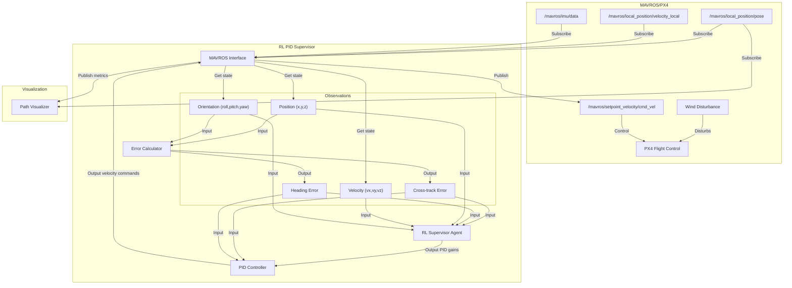

# DeepFlyer System Architecture

## RL-as-Supervisor Architecture

The following diagram illustrates the architecture of the RL-as-Supervisor approach for drone path following:

## Data Flow

1. The MAVROS interface subscribes to position, velocity, and orientation topics from MAVROS.
2. The error calculator computes cross-track and heading errors based on the drone's position, orientation, and the desired path.
3. The RL agent observes the state and errors, and outputs PID gain adjustments.
4. The PID controller uses these gains to compute velocity commands.
5. The MAVROS interface publishes the velocity commands to control the drone.

## Components

### MAVROS Interface

The MAVROS interface handles communication with the PX4 flight controller through MAVROS. It subscribes to position, velocity, and orientation topics, and publishes velocity commands.

### Error Calculator

The error calculator computes cross-track and heading errors for path following. Cross-track error is the perpendicular distance from the drone to the path, and heading error is the difference between the drone's heading and the path direction.

### RL Supervisor Agent

The RL supervisor agent observes the state and errors, and outputs PID gain adjustments to improve path following performance. It uses a neural network to approximate the optimal PID gains for different situations, including wind disturbances.

### PID Controller

The PID controller computes velocity commands based on cross-track and heading errors, using gains adjusted by the RL agent. It outputs linear and angular velocity commands to control the drone.

### Path Visualizer

The path visualizer displays the drone's path, cross-track error, heading error, and PID gains during path following. It helps monitor the performance of the system. 